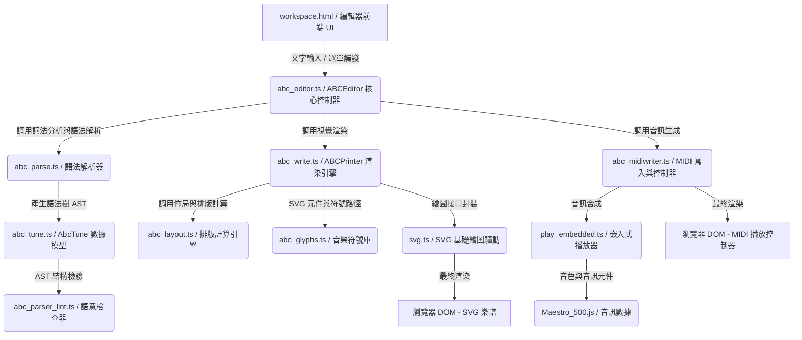

# ABCJS TypeScript (abcTS) 專案核心架構與渲染分析報告

本報告針對 `abcTS` 專案進行深度源碼分析，剖析其核心的音樂排版渲染、音訊合成，以及從文字輸入到五線譜/音訊輸出的資料流。本專案是將經典的 JavaScript 樂譜渲染庫進行 TypeScript 化移植的產物。

---

## 1. 專案整體架構與核心模組 (System Architecture)

`abcTS` 的整體架構圍繞著**「文字解析 (Parser)」**與**「視覺呈現 (Renderer)」**兩大核心。其模組可依功能性質劃分為四大層級：



### 1.1 設定與掛載入口層 (Configuration & Mount Entry)
*   **`src/index.ts`**：專案唯一的打包進入點。此處使用 ES Module 的 `import` 將所有分散的原始檔案串聯，並在執行期將關鍵的類別與全域變數（如 `ABCEditor`、`AbcTuneBook`、`AbcParse`）掛載至 `window` 全域物件，供網頁中的 legacy 腳本調用。
*   **`vite.config.ts`**：Vite 建置設定檔。內置了 `abcjs-bundle-plugin` 插件，在編譯期會動態解析 `index.ts` 中的 `import` 語句，並將這些檔案拼接成一個連續的作用域，避免各個沒有 export/import 宣告的 TS 模組在打包後因範疇隔離而產生執行期 ReferenceError。

### 1.2 編輯器與控制器層 (Editor & Controller)
*   **`src/abc_editor.ts`** (`ABCEditor`, `EditArea`)：
    *   **EditArea**：封裝 HTML `<textarea>`，監聽滑鼠移動與鍵盤輸入事件。
    *   **ABCEditor**：主控制器。當用戶編輯代碼時，此類別會以 Debounce（300ms 延遲）觸發 `updateRendering()`，依序發起「解析 -> 排版 -> 視覺繪製 -> 音訊與警告生成」的調度。

### 1.3 語法解析層 (Parser & AST)
*   **`src/abc_tunebook.ts`** (`AbcTuneBook`)：預處理器。負責將輸入的大段文字依據 `X:` (樂曲編號標記) 切割為多首獨立的樂曲。
*   **`src/abc_tokenizer.ts`** (`AbcTokenizer`)：詞法分析器。提供 token 提取（如數字、分數、特定括號字串等）的低階 API。
*   **`src/abc_parse_header.ts`** (`AbcParseHeader`)：標頭解析器。負責解析 ABC 樂譜中的元數據與控制資訊（如標題 `T:`、調號 `K:`、拍號 `M:`、單位音符時值 `L:` 等）。
*   **`src/abc_parse.ts`** (`AbcParse`)：語法解析核心。遍歷樂譜文字流，將音符、休止符、小節線、連音線等解析為對應的結構物件，並組裝至 AST。
*   **`src/abc_tune.ts`** (`AbcTune`)：抽象語法樹 (AST) 物件模型。存放樂譜的每一行 (Staff)、每一部聲部 (Voice) 的音符物件陣列、中介數據與排版資訊。
*   **`src/abc_parser_lint.ts`** (`AbcParserLint`)：利用 `jsonschema-b4.js` 提供的 JSON Schema 驗證功能，檢驗生成的 `AbcTune` AST 結構是否符合標準，防止出現損毀或未定義的欄位，通常用於開發除錯與回歸測試。

### 1.4 視覺排版與渲染層 (Layout & Visual Renderer)
*   **`src/abc_layout.ts`**：排版計算引擎。負責將 AST 轉換為實體的幾何空間佈局。計算每行樂譜的寬度、聲部間距、小節線位置、自動分行 (Line Breaking) 以及歌詞定位。
*   **`src/abc_glyphs.ts`**：符號庫。以 SVG `<path>` 的 Path Data 形式儲存所有音樂符號（如高音譜號、低音譜號、各類時值音符符頭、升降記號等）的向量圖案。
*   **`src/abc_graphelements.ts`**：視覺元件包裝。封裝小節線、音符符尾、連線等幾何計算。
*   **`src/svg.ts`** (`Svg`)：繪圖接口封裝。封裝了底層的 SVG DOM 繪製，提供像是 `createPath()`、`createText()`、`createLine()` 等基本繪圖指令。
*   **`src/abc_write.ts`** (`ABCPrinter`)：渲染主引擎。負責遍歷排版後的 AST，依據座標計算調用 `svg.ts` 及 `abc_glyphs.ts`，將音符、譜線、歌詞與連音符號等**實際渲染為 SVG DOM 節點**。

### 1.5 音效合成與播放層 (Audio Synthesis & Playback)
*   **`src/abc_midiwriter.ts`** (`ABCMidiWriter`)：將 `AbcTune` 中的時值與音高，轉換為標準的 MIDI 二進位格式，並**在網頁中生成、渲染 MIDI 播放控制器的 HTML**（如播放/暫停按鈕、嵌入的播放狀態列）。
*   **`src/play_embedded.ts`** (`PlayEmbedded`)：結合 `Maestro_500.js` 音色庫，呼叫 Web Audio API 或是嵌入式播放器，驅動音訊解碼與合成發聲。

---

## 2. `<select>` 樂譜參數進入 ABC 結構的流程分析 (Data Flow)

在 `workspace.html` 工作區中，用戶從下拉選單選擇不同樂譜，將數據代入並繪製的詳細資料流與函式調用鏈如下：

```
[使用者在選單中選擇一首樂譜]
  │
  ▼
[workspace.html: pickTune(value)]
  │ 1. 替換轉義字元 (將 `n 換成換行，`a 換成單引號)
  │ 2. 將轉換後之 ABC 原始字串寫入 <textarea id="abc"> 中
  │ 3. 呼叫 render() 啟動重新渲染
  ▼
[workspace.html: render()]
  │ 建立 ABCEditor 實例 (若已建立，則由監聽器自動捕捉變更)
  ▼
[abc_editor.ts: new ABCEditor()]
  │ 1. 綁定 textarea 的 Change 與 Selection 監聽器
  │ 2. 調用 updateRendering()
  ▼
[abc_editor.ts: updateRendering()]
  │ 1. 獲取 textarea.value 字串內容
  │ 2. 建立 AbcTuneBook 解析多首樂曲
  │ 3. 建立 AbcParse 物件解析第一首樂曲 (abcParser.parse)
  ▼
[abc_parse.ts: abcParser.parse(abcText)]
  │ 1. 使用 AbcTokenizer 進行詞法標記化
  │ 2. 使用 AbcParseHeader 解析標頭資訊 (T:, K:, M:, L: 等)
  │ 3. 逐步解析音符、小節與歌詞，組裝至 AbcTune AST 中
  ▼
[abc_editor.ts: updateRendering() 繼續調用繪圖]
  │ 1. 建立 Svg 實例繫結至目標畫布 (id: "canvas")
  │ 2. 建立 ABCPrinter 實例
  │ 3. 呼叫 printer.printABC(tune)
  ▼
[abc_write.ts: printer.printABC(tune)]
  │ 1. 調用 abc_layout.ts 計算所有音符、譜線與歌詞的幾何座標
  │ 2. 透過 Svg 物件在 canvas 容器中繪製 SVG 節點，呈顯樂譜
  ▼
[abc_editor.ts: updateRendering() 繼續調用 MIDI 生成]
  │ 建立 ABCMidiWriter 實例並調用 writeABC(tune)
  ▼
[abc_midiwriter.ts: writeABC(tune)]
  │ 1. 將音符轉換為 MIDI Tracks
  │ 2. 在網頁 DOM 中建立 MIDI 播放器 HTML (播放/停止按鈕)
  │ 3. 將播放功能與 play_embedded.ts (PlayEmbedded) 連接，準備發聲
```

---

## 3. 各檔案之功能、元件與渲染職責 (Roles & Rendering Responsibilities)

| 檔案名稱 | 核心元件/類別 | 渲染職責 (Rendering Output) | 備註說明 |
| :--- | :--- | :--- | :--- |
| **`workspace.html`** | 前端頁面容器 | 渲染文字輸入框 (`textarea`)、樂譜下拉選擇選單 (`select`)、操作按鈕（如 Save, Play 等），以及供 SVG 樂譜 (`#canvas`) 與 MIDI 播放器 (`#midi`) 掛載的容器。 | 使用者操作工作區 |
| **`svg.ts`** | `Svg` | **直接渲染 SVG 核心 DOM。** 負責在網頁中建立 `<svg>` 根節點，並提供 `rect`、`line`、`path`、`text` 等基本圖案的 DOM 建立 API。 | 繪圖底層封裝 |
| **`abc_glyphs.ts`** | 音樂符號路徑庫 | 無直接 DOM 渲染，返回 SVG Path Data 規格的字串（如高音譜號路徑 `M20,10 C...`）。 | 由 `ABCPrinter` 調用並通過 `Svg.createPath` 繪入 DOM |
| **`abc_write.ts`** | `ABCPrinter` | **直接渲染五線譜 SVG。** 遍歷排版後的 AST，調用 `Svg` API 將音符、小節線、調號、拍號、休止符和歌詞繪入畫布中。 | 視覺呈現引擎 |
| **`abc_midiwriter.ts`** | `ABCMidiWriter` | **渲染 MIDI 播放器面板。** 在 `#midi` 容器中動態生成 HTML 元素（如 `<input type="button" value="Play" />`）。 | 音訊控制介面 |
| **`play_embedded.ts`** | `PlayEmbedded` | 無 DOM 渲染，利用 Web Audio API 及音訊緩衝區驅動聲卡發聲。 | 聲音合成核心 |
| **`abc_parser_lint.ts`** | `AbcParserLint` | 渲染回歸測試所用的「可讀式純文字 Schema 格式化輸出」，無視覺 DOM 渲染。 | AST 規格檢驗器 |

---

## 4. 專案改進建議 (Improvement Suggestions)

基於當前 `abcTS` 的設計，有以下幾點關鍵的架構與技術改進建議：

### 4.1 徹底進行 ESM 模組解耦，淘汰「串聯式拼接打包」
*   **現狀分析**：目前 `vite.config.ts` 使用自訂插件讀取 `index.ts` 中所有的 `import './xxx'`，並在記憶體中將全部原始碼拼成一個巨大的單一模組，以繞過各檔案間互相依賴全域變數的問題。
*   **建議做法**：逐步為每個 TS 檔案（例如 `abc_parse.ts`, `abc_layout.ts`）加上頂部 `import` 與底部 `export` 宣告。使它們真正解耦，這能讓 Vite 發揮 Rollup 的 Tree-shaking 威力，也能讓 IDE 的型別推導與自動完成發揮最大作用。

### 4.2 改進渲染效能 (Debounce & Web Worker)
*   **現狀分析**：當用戶快速輸入時，雖然 `ABCEditor` 設有 300ms 的 debounce，但在處理大於 100 小節的大型樂譜時，同步執行詞法分析、AST 生成與幾何排版計算會阻塞主執行緒，造成網頁輸入遲滯或卡死。
*   **建議做法**：
    1. 將 `AbcParse` 搬移至 **Web Worker** 中執行，在背景執行解析，完成後將 AST 數據傳回主執行緒。
    2. 引進**局部渲染 (Partial / Incremental Rendering)** 機制，只重新繪製被修改的 Staff (小節行)，而不必每次都清空整個 `#canvas` 重新渲染。

### 4.3 現代化 UI/UX 面板升級
*   **現狀分析**：`workspace.html` 的 UI 設計依賴較傳統的 `<table>` 排版和原生下拉選單，與現代 premium 的網頁美學有落差。
*   **建議做法**：
    1. 採用現代 Web 組件，加入流暢的暗黑模式 (Dark Mode) 支持，並提供可拖曳的編輯/預覽分割面板。
    2. 在 SVG 樂譜中加入實時滑鼠懸停的高亮提示 (Hover Highlight)，以及音符點擊播放功能。

### 4.4 升級音效合成器
*   **現狀分析**：目前專案採用的 `play_embedded.ts` 與舊音色庫（`Maestro_500.js`）發聲品質較單調。
*   **建議做法**：可導入現代的 Web Audio 合成架構（例如配合 `Tone.js`），並引進 SoundFont 支援，讓用戶可以自由切換鋼琴、小提琴、長笛等更逼真的音色，並支援動態音量與混響調整。
